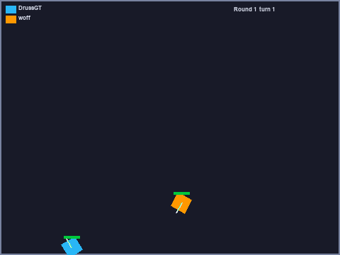

# woff 🐶

Bot **Robocode Tank Royale** (C# / .NET 9) buatan [himanusia](https://github.com/himanusia).

## Ini robot yang gimana?

woff itu bot 1v1 yang mengandalkan **targeting prediktif** + **movement evasive**:

### 🎯 Targeting: Multiple Choice Play It Forward (MCPiF) via Monte Carlo
- Simulasi **48 skenario** (Monte Carlo) buat milih arah tembak terbaik.
- Prediksi gerak musuh pakai **N-gram multi-order** (`NGRAM_ORDER = 7`, minimum 2) dari riwayat posisi relatif musuh.
- Skor tiap arah dihitung di **1080 angle bins**; bin terbaik = arah tembak.
- **Virtual bullets**: woff "menembak" secara virtual buat deteksi energy drop musuh (musuh nembak = energinya turun), lalu memprediksi posisi musuh saat bullet-nya bakal sampai.
- Fallback **head-on** kalau data musuh belum cukup.
- Referensi teknik MCPiF (markov chain & monte carlo): [video ini](https://www.youtube.com/watch?v=KZeIEiBrT_w&t=28s).

### 🏃 Movement: Anti-Gravity & Stop and Go
- **Anti-Gravity**: arena di-sampling 36 titik, tiap titik dapat gaya tolak dari musuh, bullet, lokasi terakhir musuh, dan sudut arena. Titik dengan gravitasi minimum = tujuan gerak (dengan override threshold biar nggak terlalu sering ganti arah).
- **Stop and Go (sag)**: gerak zig-zag ±90° relatif ke musuh saat jarak dekat (< 250px) — bikin targeting musuh kena prediction error; otomatis berhenti kalau mentok tembok/corner.

### 📡 Lainnya
- Radar lock (`RADAR_LOCK`) biar musuh nggak lepas dari scan.
- Manajemen musuh multi-target (`enemyData` per id) + prioritas target.
- Warna body random tiap ronde (anti-gravity color scheme 🎨).

## Changelog singkat
- **v1.3** — multi-order N-gram
- **v1.2** — MCPiF pakai Monte Carlo simulation, fix arah virtual bullet
- **v1.1** — fix Stop and Go nabrak tembok, gravitasi baru, graphical debugging

## Cara jalanin

Butuh .NET SDK 9 + Tank Royale server (atau battle runner):

```sh
dotnet build
dotnet run --no-build
```

Atau lewat battle runner (headless) — lihat setup lengkap di `~/Code/robocode/README.md`:

```sh
cd ~/Code/robocode
./scripts/run-battle.sh bots/woff bots/jk.mega.DrussGT_3.1.12
```

## Hasil sparring vs bot leaderboard RoboRumble (via bridge)

| Battle | Hasil |
|---|---|
| woff vs Anjing (2R) | **woff 360–0** ✅ |
| 4 bot: woff, Diamond, BeepBoop, DrussGT (5R) | 1. Diamond · **2. woff 927** · 3. BeepBoop · 4. DrussGT |
| 1v1 woff vs DrussGT (5R) | DrussGT 305–275 (woff unggul bullet damage 140–111) |

## 📸 Cuplikan strategi



## Catatan migrasi

Versi awal woff pakai `Robocode.TankRoyale.BotApi 0.30.0` yang drawing-nya `System.Drawing` (Windows-only)
→ crash di macOS. Sudah di-migrasi ke **1.0.2**:
- `System.Drawing` (`Pen`, `Color.FromArgb`, `DrawEllipse`) → API `IGraphics` Tank Royale (`SetStrokeColor`, `DrawCircle`, `DrawRectangle`, `Color.FromRgb`) — cross-platform.
- Dependency `Microsoft.Extensions.Configuration.Binder` di-bump ke 10.0.0 (dibutuhkan BotApi 1.0.2).
